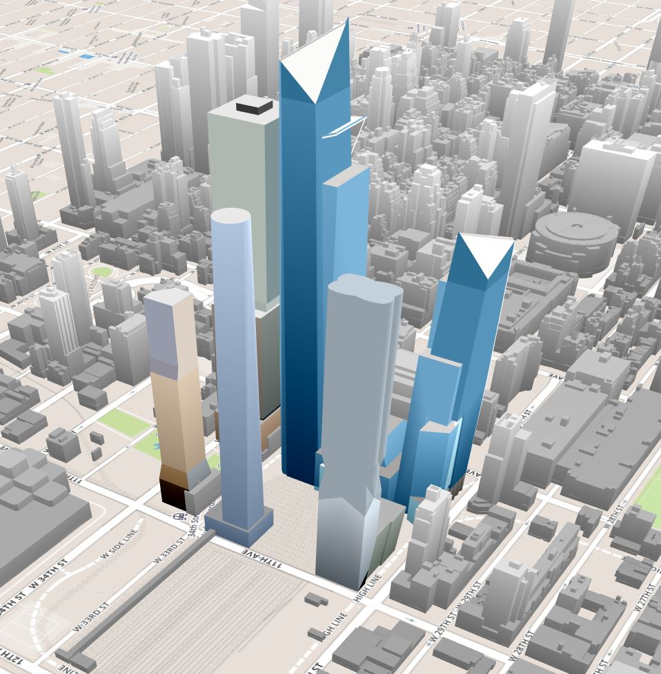

# hy_3d_viz
Hudson Yards

This is a testing website showing 3D capabilities of [OSM-Buildings](https://github.com/OSMBuildings/OSMBuildings) module.
City model comes from [NYC 3-D Building Model](https://www1.nyc.gov/site/doitt/initiatives/3d-building.page) provided by [NYC DOITT](https://www1.nyc.gov/site/doitt/index.page). 
Hudson Yards model was obtained from [SketchUp 3D Warehouse](https://3dwarehouse.sketchup.com/) and was designed by [Alpha Virtual World](https://3dwarehouse.sketchup.com/user/1317421059891422302646981/Alpha-Virtual-World).
